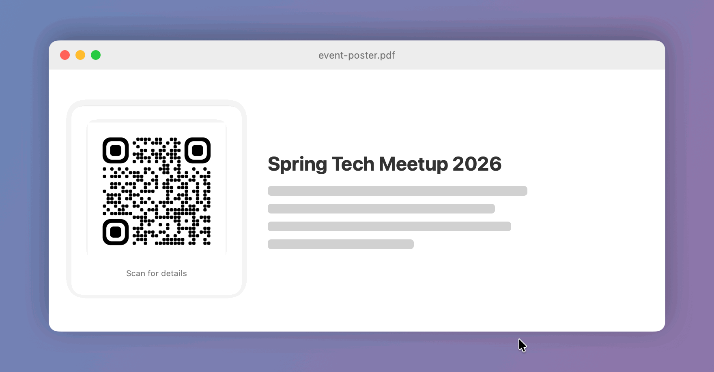
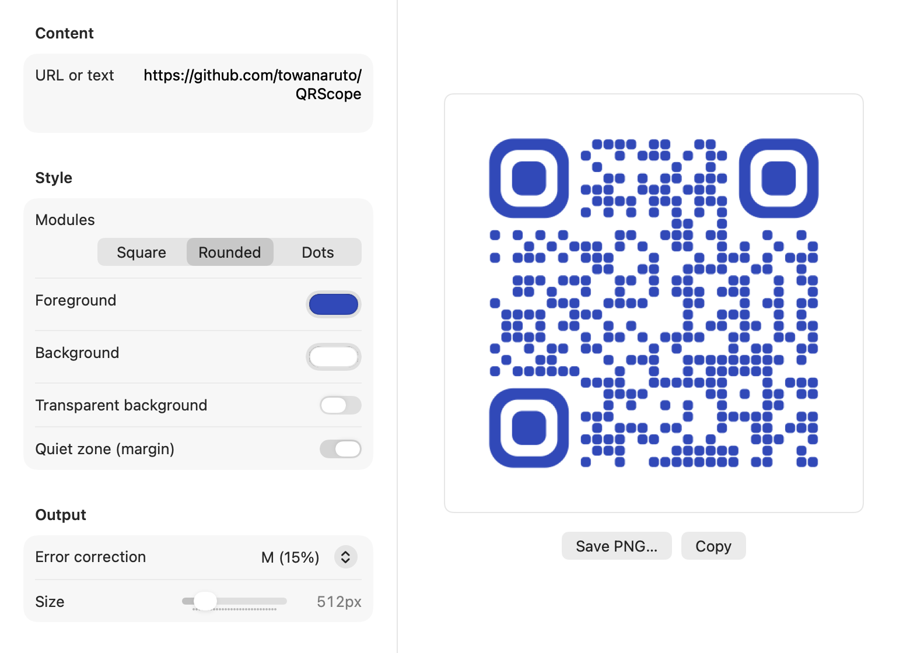
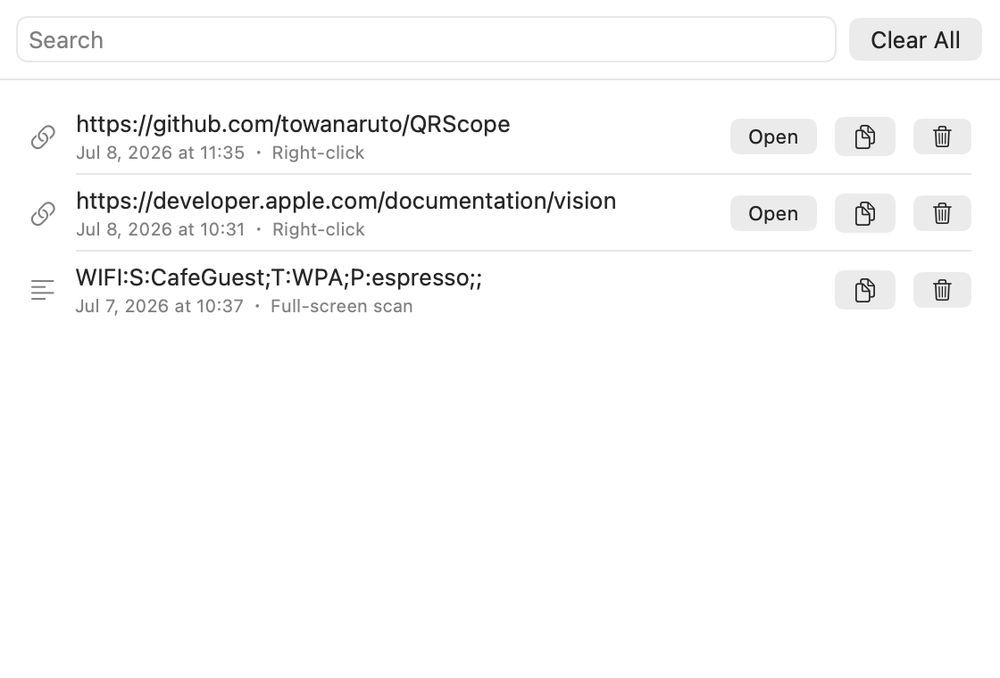

# QRScope

**画面上のQRコードを右クリック+ワンクリックで開く。**

QRScope は macOS のメニューバーアプリです。Webページ・PDF・写真・ビデオ通話など、画面に映っているQRコードの上で右クリックすると、カーソルのすぐ横に「開く」ボタン付きのチップが表示されます。

[English README is here](README.md)



## 特徴

- ⚡ **高速** — Swift + Apple Vision フレームワーク(ハードウェア支援)。右クリックから数十ミリ秒で検出
- 🔋 **省電力** — 常時ポーリングなし。右クリックの瞬間にカーソル周辺だけをキャプチャするため、バックグラウンド負荷はほぼゼロ
- 🖱️ **直感的** — アプリを開いたりスクリーンショットを撮る必要なし。QRの上で右クリックするだけ
- 📜 **履歴** — 開いた/コピーした内容を自動保存(検索・削除対応)
- 🎨 **QR生成** — 前景色/背景色・透明背景・モジュールスタイル(スクエア/角丸/ドット)・誤り訂正レベル・サイズを指定してPNG保存/コピー
- 🔗 **リンクからQR作成** — URLを選択、またはリンクが埋め込まれたテキストを右クリックすると「QRを作成」チップが表示され、その場でQRを表示してスマホで読み取り・PNGコピー・保存ができる(アクセシビリティ権限が必要)
- 📋 **クリップボードからQR作成** — 任意のURLをコピーして ⌃⌥⌘V(またはメニューバーの「クリップボードのURLをQR化」)で即座にQR化。リンクをアクセシビリティに公開しないアプリ(Slack等 Electron/Chromium系)ではこちらを使う
- 📱 **iPhoneカメラで読み取り** — 連係カメラ(Continuity Camera)でiPhoneがスキャナーに。実世界のQRコードにかざして、結果をMacで開ける(内蔵カメラにも対応)
- 🔄 **自動アップデート** — GitHub Releases を1日1回チェックし、ワンクリックで自己更新(メニューバーの「アップデートを確認…」からも実行可能)。アップデートしても権限は維持される
- 🌐 **多言語** — システム言語に合わせて英語/日本語を自動切替
- 🔍 QRのほか Aztec / DataMatrix コードにも対応

## スクリーンショット

| QR生成 | 読み取り履歴 |
|:---:|:---:|
|  |  |

## インストール

必要環境: macOS 14 (Sonoma) 以降。

### Homebrew(推奨)

```bash
brew tap towanaruto/tap
brew trust towanaruto/tap   # Homebrew 6以降
brew install --cask qrscope
xattr -d com.apple.quarantine /Applications/QRScope.app
```

アプリは ad-hoc 署名(未公証)のため、そのままでは Gatekeeper にブロックされます。`xattr` の行で検疫属性を外してください。その後、アプリケーションフォルダから QRScope を起動できます。

### ソースからビルド

Xcode Command Line Tools が必要です。

```bash
git clone https://github.com/towanaruto/QRScope.git
cd QRScope
./Scripts/build-app.sh        # 安定署名アイデンティティがあればそれで署名(下記参照)
open build/QRScope.app
```

リリースを配布するメンテナは、最初に一度 `./Scripts/create-signing-cert.sh` を実行してください。安定した自己署名アイデンティティを作成し、自動アップデート後も TCC 権限(画面収録など)が維持されるようにします。無い場合は ad-hoc 署名にフォールバックし、更新のたびに権限が外れます。

### 権限の付与

初回起動時に**画面収録**の許可を求められます(検出に必須):

1. **システム設定 → プライバシーとセキュリティ → 画面収録** を開く
2. **QRScope** を有効にする
3. QRScope を再起動する

選択リンクからのQR作成を使う場合は、追加で**アクセシビリティ**権限を許可してください(メニューバー → **⚠️ アクセシビリティを許可**)。未許可でもQR検出はそのまま使えます。

> **アップデートと権限**: リリース版は安定した署名アイデンティティで署名しているため、自動アップデートしても権限は維持されます。ただし、旧 ad-hoc 版(1.4.0 以前)から 1.5.0 へ上げるときだけは一度だけ再許可が必要で、それ以降は維持されます。

## 使い方

| 操作 | 動作 |
|------|------|
| QRコードの上で右クリック | カーソル横にチップ表示 → 「開く」でリンクを開く、📋 でコピー |
| URLの選択 or 埋め込みリンクを右クリック | 「QRを作成」でその場にQRを表示(スマホで読み取り可)、📋 でQRをPNGコピー、⬇️ で保存 |
| URLをコピー → ⌃⌥⌘V(またはメニューの「クリップボードのURLをQR化」) | クリップボードのURLをQR化。Slack等 Electron/Chromium系アプリでも使える |
| メニューバー → 画面全体をスキャン | 全ディスプレイのQRを一括検出 |
| メニューバー → iPhoneカメラで読み取り… | 連係カメラ(または内蔵カメラ)のスキャナーウィンドウを開き、「開く」で結果をMacで開く(カメラ権限が必要) |
| メニューバー → 読み取り履歴… | 開いた/コピーした内容の検索可能な一覧 |
| メニューバー → QRコードを生成… | スタイル指定つきQR生成・PNG書き出し |
| メニューバー → ログイン時に自動起動 | ログイン項目に登録 |
| メニューバー → アップデートを確認… | GitHubの最新リリースをダウンロードしてその場で差し替え |

チップは他の場所をクリックするか12秒経つと自動で消えます。

> 埋め込みリンクの「QRを作成」チップは macOS のアクセシビリティAPIでURLを読み取ります。ネイティブアプリ(TextEdit・メモ・メール・Safari 等)はリンクURLを公開しますが、Electron/Chromium系アプリ(Slack・Discord・VS Code・Chrome)は公開しません。その場合はアプリ側の「リンクをコピー」→ ⌃⌥⌘V を使ってください。

安全のため「開く」が有効になるのは `http(s)` `mailto` `tel` `sms` `facetime` `maps` スキームのみです。それ以外の内容(Wi-Fi設定・連絡先など)はコピーで取得できます。

## 仕組み

```
右クリック(NSEventグローバル監視 ※アクセシビリティ権限なしで動作)
  → 選択テキストを読み取り(アクセシビリティAPI ※URLのときだけチップに追加)
  → カーソル周辺をキャプチャ(ScreenCaptureKit / SCScreenshotManager)
  → バーコード検出(Vision / VNDetectBarcodesRequest ※バックグラウンドスレッド)
  → カーソル横にチップ表示(非アクティブ化NSPanel ※フォーカスを奪わない)
  → 開く/コピー → 履歴保存(~/Library/Application Support/QRScope/history.json)
  → 選択リンクからQR作成 → その場で読み取り/コピー/PNG保存
```

## 開発

```bash
swift build                        # デバッグビルド
.build/debug/QRScope --selftest    # 全スタイルの生成→検出ラウンドトリップ検証
```

## ライセンス

[MIT](LICENSE)
